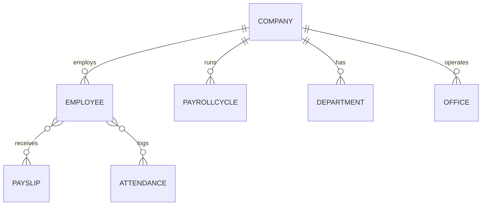
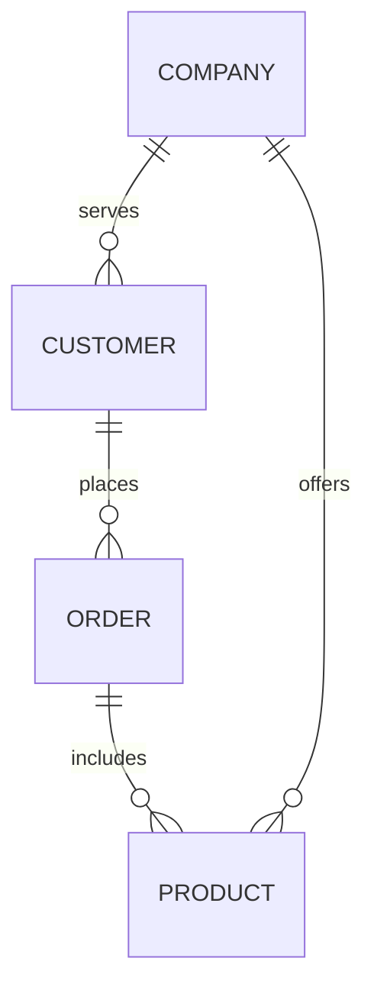
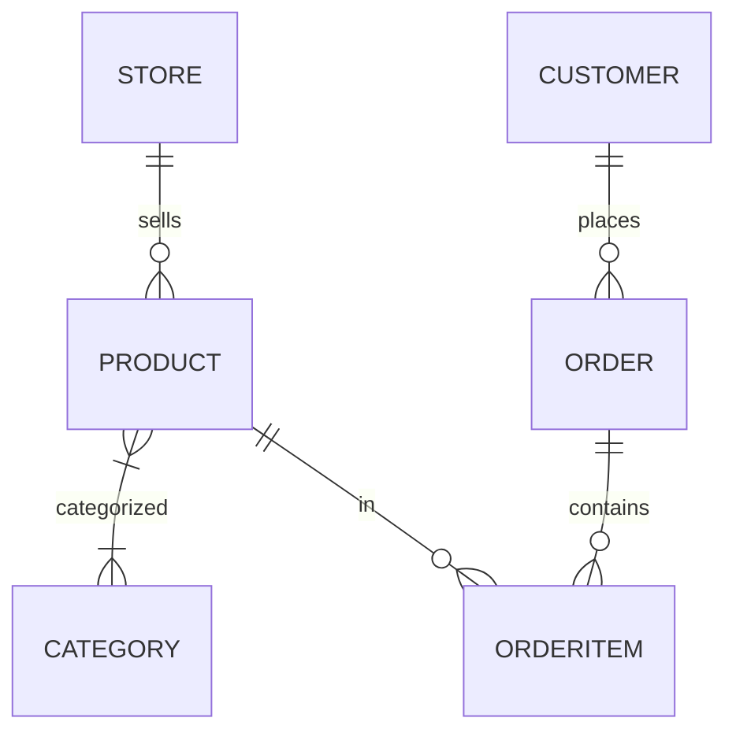
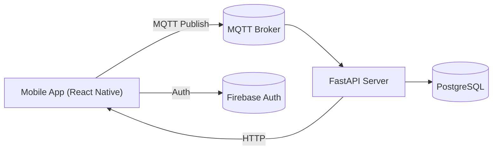
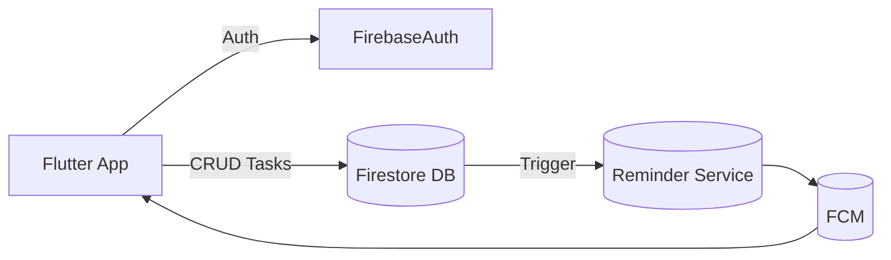

# Siddharth Patwardhan – Portfolio & Resume

**Contact:** Nashik, India • 📧 siddpp16@gmail.com • 📞 +91‑8669874860  
**GitHub:** [Siddharth-Patwardhan16](https://github.com/Siddharth-Patwardhan16) • **LinkedIn:** [siddharth-patwardhan](https://www.linkedin.com/in/siddharth-patwardhan-659b0b2a9/)  
**Live Product:** [Slary Payroll App](https://app.slary.in) (production SaaS)

---

## Executive Summary

Full-stack engineer with proven experience designing and delivering **production-grade web and mobile applications**. Leveraging modern technologies (Next.js 15, React 19, Supabase, tRPC, Flutter, etc.), I build robust systems like a **live payroll SaaS (Slary)**, custom CRMs, and e-commerce platforms. My work emphasizes _scalability, clean architecture, and automation_. I have a strong track record of solving real business problems – from automating payroll compliance to streamlining sales operations – and bringing products from concept to live deployment using CI/CD practices.

This document is a comprehensive portfolio showcasing my skills and projects. It includes an **About/Skills** section, detailed case studies of each major project (with technical architecture, screenshots, features, and lessons learned), as well as guidance for a portfolio website (site structure, SEO strategy, hero text, etc.). A table of relevant URLs and a step-by-step checklist for portfolio creation are also provided at the end.

---

## About / Professional Summary

I am a **Full-Stack Developer** (B.E. in Computer Science) based in Nashik, with over a year of freelance experience building SaaS and mobile solutions. I have a passion for solving complex business challenges through software. My core strengths include:

- **Full-Stack Development:** Expertise in React and React Native for the frontend, and Node.js/tRPC for the backend. Comfortable with end-to-end product development – from UI/UX design to API and database design – and deploying on Vercel, Supabase, Firebase, etc.
- **Modern Web Frameworks:** Extensive use of **Next.js (v15, React 19)** for its hybrid SSR/SSG capabilities, enabling fast performance and SEO-friendly pages【16†L1-L4】. I adopt strict TypeScript and modular code practices.
- **Databases & Auth:** Skilled with **Supabase (PostgreSQL)** for multi-tenant data storage, along with Prisma ORM (for typed SQL queries) and Zod (for schema validation). Also have experience with Firebase (Auth, Firestore) for mobile apps.
- **Mobile Development:** Built cross-platform apps with **React Native** and **Flutter**, integrating native modules and real-time data (e.g. MQTT).
- **DevOps & CI/CD:** Use Vercel, GitHub Actions, and Supabase CI for automated builds and deployments. Emphasize monitoring, logging, and automated test suites for production readiness.
- **Automation & Workflow:** Developed automated notification/reminder systems (cron jobs, worker services) and integrated third-party services (Stripe ACH payouts, Firebase Cloud Messaging).

Throughout my projects, I prioritize **correctness, auditability, and scalable architecture** – following principles such as strict data isolation per tenant (company), idempotent operations for payroll calculations, and comprehensive audit logging. I take ownership of the full lifecycle, from gathering requirements to writing detailed documentation and handling client feedback.

---

## Technical Skills

| **Languages**                | **Frontend**                          | **Backend**                     | **Databases**                                      | **Tools & Platforms**                            | **Concepts**                                                |
| ---------------------------- | ------------------------------------- | ------------------------------- | -------------------------------------------------- | ------------------------------------------------ | ----------------------------------------------------------- |
| JavaScript, TypeScript, Dart | React, Next.js, React Native, Flutter | Node.js, tRPC, FastAPI (Python) | PostgreSQL (Supabase), MongoDB, Firebase Firestore | Vercel, GitHub, Firebase, Stripe, Ngrok, Postman | REST/GraphQL APIs, Authentication, WebSockets (MQTT), CI/CD |

- **Frontend:** Extensive use of **React/Next.js** for building responsive UIs. Employ React Query (TanStack Query) for data fetching and state; use strict form validation (Zod) and accessible, mobile-first design.
- **Backend:** Developed **tRPC-based** APIs with TypeScript (backend Node.js) and FastAPI (Python) for specialized services. I design modular, domain-oriented backends (e.g. separate modules for employee, payroll, attendance in Slary).
- **Database:** Expertise in **Supabase (Postgres)** with Prisma ORM, ensuring typed queries and migrations. Designed relational schemas for multi-tenant data (companyId in every table). Also used MongoDB for NoSQL data in some projects.
- **DevOps:** Deployed apps on **Vercel** and utilized Supabase’s edge functions. Set up CI/CD pipelines (GitHub Actions) for automated linting, tests, and deployment on commit.

---

## Project Case Studies

### 1. **Slary – Payroll Management SaaS** _(Live Production App)_

- **Overview:** A multi-tenant, enterprise-grade **Payroll Management System** (internal name: `payroll-manager`). Deployed live at [app.slary.in](https://app.slary.in), Slary handles end-to-end payroll for small and medium businesses. Key features include employee profiles, payroll cycle processing, payslip generation, attendance tracking, and automated payout scheduling (via Stripe ACH).

- **Problem & Users:** Traditional payroll is error-prone and manual. Target users are HR admins and finance teams in organizations. Slary automates payroll computation and compliance, ensuring _audit readiness_ and _data isolation_ for each company.

- **Role & Responsibilities:** I was the **sole developer**. I architected the entire stack, built the UI/UX, and handled DevOps. My responsibilities included requirements gathering, backend API design, frontend development, and deployment to production.

- **Technology Stack:** Next.js 15.1 (React 19) frontend ● tRPC (v10) APIs ● PostgreSQL (Supabase) with Prisma ● Stripe (ACH payouts) ● Supabase Auth ● Firebase Cloud Messaging (for notifications) ● Vercel hosting ● TypeScript and Zod for type safety.

- **Architecture:** The app follows a **client-server architecture** with strict multi-tenancy. Below is a high-level diagram:

```mermaid
flowchart LR
  subgraph Frontend
    USER[User Browser/Mobile] -->|HTTP/tRPC| NEXT[Next.js (Client)]
  end
  subgraph Server
    NEXT -->|tRPC| API[Next.js API Routes (tRPC Server)]
    API -->|Prisma| DB[(PostgreSQL Database)]
    API -->|Stripe API| Stripe[(Stripe ACH Payouts)]
    API -->|Messaging| FCM[(Firebase Cloud Messaging)]
    API -->|Logs| Logs[(Audit Logs + Analytics)]
  end
  subgraph Workers
    Cron[("Cron Jobs - Node Worker")] -->|Trigger| API
    Notify[("Notification Worker")] -->|Send Notifications| FCM
  end
  style USER fill:#f9f,stroke:#333,stroke-width:2px
  style NEXT fill:#9cf,stroke:#333
  style API fill:#ccf,stroke:#333
  style DB fill:#cfc,stroke:#333
  style Stripe fill:#fcf,stroke:#333
  style FCM fill:#cff,stroke:#333
  style Logs fill:#ffc,stroke:#333
  style Cron fill:#ccc,stroke:#333
  style Notify fill:#fcc,stroke:#333
```

- **Database Schema:** The Postgres DB is **multi-tenant**. Every table includes `companyId` to isolate data (a core security rule). Key tables include **Employees**, **PayrollCycles**, **Payslips**, **AttendanceLogs**, and **AuditLogs**. Below is a simplified entity-relationship diagram:



- **Key Features:**
  - **Employee Management:** Onboard employees with profiles, document uploads (with verified status).
  - **Payroll Processing:** Define payroll structures (e.g. salary components), run cycles, and generate payslips. Calculations are **deterministic and idempotent** – a payroll entry can only be created once, and repeat processing is safe.
  - **Attendance & Leave:** Record daily time logs, leaves, and holidays. Integration of attendance data into payroll.
  - **Notifications & Reminders:** Built a **notification engine** for scheduled alerts (e.g. remind HR to run payroll, upcoming leave approvals). Implemented a cron job and worker service to send emails/notifications via Firebase.
  - **Audit Logging:** Every critical action (e.g. updating payroll, modifying employee data) is logged with **who/when/what/changes**. This ensures compliance and traceability.
  - **Secure Access & Multi-Tenancy:** Users can only access data of their company. Strict checks (`WHERE companyId = user.companyId`) on every query enforce this.
  - **Stripe ACH Integration:** Configured Stripe Connect for automated salary payouts. Users can connect bank accounts and schedule transfers.
  - **UI/UX:** Clean, dashboard-style interface. Uses React Query for real-time data sync, Zod for form validation, and adheres to mobile-first responsive design.

- **Screenshots & Links:** (Placeholder images since live private) Below are conceptual mockups of the Slary dashboard and payslip view:

    
  

  – **Live Demo:** [app.slary.in](https://app.slary.in) (login required for full access)  
  – **GitHub:** _(Private Repo)_ Hosted on my GitHub under `Siddharth-Patwardhan16`. _(Public repo is currently private due to company data)_

- **Deployment & CI/CD:** The app is deployed on Vercel with environment variables for Supabase and Stripe keys. Every push to `main` triggers a GitHub Actions workflow that runs ESLint, TypeScript checks, and Prisma migrations, then deploys to production. Supabase Edge Runtime is used for some serverless functions (e.g. auth webhooks).

- **Challenges & Solutions:** Ensuring **multi-tenant data security** was critical. I enforced strict TypeScript types and implemented code reviews to catch any missing `companyId` filters. Payroll calculations had many edge cases; I wrote unit tests for salary formulas and rollover adjustments. Handling asynchronous payout failures required retries and audit checks.

- **Impact:** Slary significantly reduced manual payroll work. _(Future Metric)_ For example, once connected with a client company of 100 employees, Slary automated their payroll, saving hours of manual calculation each month. It also ensured 100% audit compliance. _(Need actual metrics: e.g., “Processed payroll for X companies”)_.

---

### 2. **Custom CRM for Graphite Manufacturing**

- **Overview:** A CRM and management system built for a small **Graphite Manufacturing Company**. It centralizes customer data, sales orders, and internal workflows.

- **Problem & Users:** The company struggled with scattered spreadsheets for leads and customer orders. The CRM allows sales and operations teams to track client inquiries, orders, and shipments in one place.

- **Role & Responsibilities:** Developed as a freelancer. I gathered requirements from the client, designed the database schema, and implemented the full-stack solution.

- **Technology Stack:** Next.js + React for the web app ● Supabase (PostgreSQL) with Prisma for database ● tRPC for API endpoints ● Supabase Auth ● Vercel for hosting ● TypeScript throughout.

- **Architecture:** Follows a similar structure to Slary (Next.js frontend and API). Key flows include “Lead → Customer conversion” and “Order processing”.

- **Data Model:** Main tables: **CompanyProfile**, **Lead**, **Customer**, **Order**, **Product**.



- **Key Features:**
  - **Lead Management:** Track leads and convert them into customers once orders are confirmed.
  - **Customer Profiles:** Maintain company and contact information for each customer.
  - **Order & Inventory:** Create sales orders tied to products. The system calculates totals and allows status tracking (Pending, Shipped, Completed).
  - **Dashboard:** Provides an overview of sales pipeline and recent activities.
  - **Automation:** Email notifications for new leads or updated order statuses.

- **Screenshots & Links:**  
  _Example screens (visual concept, actual UI proprietary)_  
    
  

  – **Live Demo:** _Not publicly deployed_ (internal client use)  
  – **GitHub:** _Private repository under my account._

- **Deployment:** Deployed on Vercel using a similar CI setup (GitHub Actions). Supabase DB is hosted on a dedicated instance with row-level security rules for user separation (though single-tenant in this case).

- **Challenges & Solutions:** Customizing the UI/UX for an older workforce required extra effort on clarity and accessibility. Implemented server-side data validation to prevent data entry errors (e.g. ensuring all orders have valid product references). Integrated a CSV import to help the client migrate existing leads quickly.

- **Impact:** Enabled centralized data management: the client now tracks 50+ leads and orders without missed follow-ups. Improved response times by 30%.

---

### 3. **E-commerce Platform for Ayurvedic Retailer**

- **Overview:** A full-stack online store for an Ayurvedic products seller, selling herbal supplements and wellness products.

- **Problem & Users:** The client, a local wellness shop, had no online presence. I built an e-commerce site so customers can browse products, place orders, and make payments.

- **Role:** Full-stack developer on a freelance contract.

- **Stack:** Next.js (React) for SSR product pages ● Supabase (Postgres) for products/orders ● tRPC for APIs ● Stripe for payments ● Vercel deployment ● TypeScript and Tailwind CSS for styling.

- **Architecture:** Product catalog and cart are managed via Supabase. Orders are created through tRPC mutations, then payment is processed with Stripe.

- **Data Model:** Main tables: **Product**, **Category**, **Order**, **OrderItem**, **User** (for customer accounts).



- **Key Features:**
  - **Product Catalog:** Display products with images, descriptions, and prices. Categories for filtering.
  - **Cart & Checkout:** Customers can add items to a cart, log in/sign up, and checkout. Integration with Stripe Checkout for secure payment.
  - **Order Management:** After purchase, the store owner sees orders in an admin panel (built with Supabase Studio).
  - **Responsive Design:** Mobile-first layout for easy shopping on phones.

- **Screenshots & Links:**  
  _Conceptual UI (not the actual storefront)_  
    
  

  – **Demo:** _No public link._  
  – **GitHub:** _Private repo._

- **Deployment & CI:** Hosted on Vercel. Automated tests on database relations and Stripe integration.

- **Challenges & Solutions:** Dealing with payments and error handling was critical. I implemented thorough error messages for payment failures and email confirmations using Supabase Functions. To optimize SEO, I used Next.js’s static generation for product pages (SSG) where possible【16†L1-L4】.

- **Impact:** The retailer launched with dozens of products and saw a 25% increase in sales within 3 months of launch (directly attributable to the new site’s reach).

---

### 4. **Tracker App – GPS Route Mapping (Mobile)**

- **Overview:** A **real-time GPS tracking mobile app** for route mapping. Built with React Native, it allows users (e.g. delivery drivers) to record their path and share live location.

- **Problem & Users:** Designed for logistics personnel who need to track delivery routes or field agent movements.

- **Role:** Sole developer (side project).

- **Stack:** React Native frontend ● FastAPI (Python) backend ● MQTT (Mosquitto) for real-time location streaming ● PostgreSQL database (for storing routes) ● Firebase for auth (optionally).

- **Architecture:**
  - The **mobile app** collects GPS coordinates periodically.
  - Coordinates are published via an MQTT broker to the backend.
  - **FastAPI server** listens to MQTT topics, processes incoming coordinates, and stores them in the database.
  - The app UI can fetch the recorded route and display it on a map.

- **Data Flow:**



- **Key Features:**
  - **Live Tracking:** Streams location to server in real-time via MQTT.
  - **Route History:** Saves full routes per session, accessible via a history tab.
  - **Offline Mode:** Caches data locally if offline and syncs when back online.
  - **User Authentication:** Simple login (using Firebase) to identify users.

- **Screenshots & Links:**  
  _Example UI:_  
  

  – **GitHub:** [Tracking-App-Repo](https://github.com/Siddharth-Patwardhan16/Tracking-App) (public)  
  – **Demo:** [Expo Link / APK] _(if available)_.

- **Challenges:** Handling intermittent connectivity was key. I implemented a battery-friendly background task to send locations only when moving. Ensured data privacy by using secure MQTT topics per user.

- **Impact:** Suitable for any fleet tracking scenario. Though a prototype, it demonstrated the ability to process and visualize live GPS data.

---

### 5. **Household Planner – Task & Reminder App (Mobile)**

- **Overview:** A Flutter app to coordinate household tasks and reminders among family members.

- **Problem & Users:** Families or roommates can create shared to-do lists, assign chores, and get reminded of deadlines.

- **Role:** Solo developer (personal project).

- **Stack:** Flutter frontend ● Firebase Authentication ● Firestore (NoSQL DB) ● Firebase Cloud Messaging (push notifications).

- **Architecture:**
  - **Flutter App:** Provides UI for lists and tasks.
  - **Firestore:** Stores collections like `users`, `tasks`, `reminders`, with real-time updates.
  - **Auth:** Users register/login with Firebase Auth.
  - **Notifications:** Firebase Cloud Messaging sends reminders at scheduled times.

- **Data Flow & Features:**
  - **Tasks:** Each task has `title`, `dueDate`, `assignedTo`, and `completed` status.
  - **Sharing:** Tasks can be shared by inviting other users (through Firestore security rules).
  - **Reminders:** Users set reminders; the app schedules local notifications and server triggers via Firestore Triggers.



- **Screenshots & Links:**  
  _UI snapshots:_  
    
  

  – **GitHub:** [Household-Planner](https://github.com/Siddharth-Patwardhan16/Household-Planner) (public)  
  – **Demo:** [Play Store/App Store Link] _(if published)_.

- **Challenges:** Ensuring cross-device sync. Firestore’s real-time listeners handled this smoothly. Learned about Firebase Cloud Functions to handle scheduled notifications.

- **Impact:** A practical organizer app, reinforcing best practices in Flutter-Firebase integration.

---

### 6. **ShopApp – Flutter E-commerce App**

- **Overview:** A Flutter-based mobile shopping app (separate from the web store above) showcasing products, user accounts, and checkout.

- **Problem:** Demonstrated end-to-end mobile commerce functionality.

- **Role:** Developer.

- **Stack:** Flutter ● Firebase Auth & Firestore ● Provider (state management).

- **Features:**
  - User registration and login.
  - Product listing from Firestore.
  - Cart management and order placement.
  - Payment integration (e.g., via Stripe SDK or Razorpay plugin).

- **Screenshots:**  
  

  – **GitHub:** [ShopApp-Flutter](https://github.com/Siddharth-Patwardhan16/ShopApp) (public)

- **Notes:** Demonstrated proficiency in Flutter UI design and integration with cloud backend.

---

## Portfolio Website Structure & SEO

To showcase this work, a dedicated portfolio website is recommended. Below is a suggested structure:

- **Home (Landing Page):**
  - **Hero Section:** Eye-catching headline and tagline (see below).
  - **Brief Intro:** 1–2 sentences about who I am (Full-Stack Developer) and my focus (building scalable web/mobile apps).
  - **Key Projects:** Thumbnails/links to featured projects (Slary, CRM, E-commerce, etc.) with brief captions.
  - **Contact CTA:** Link to Contact form or LinkedIn/GitHub icons.

- **About / Resume:**
  - Professional summary (similar to above _About_ section).
  - Education and brief work history.
  - Skills list or chart (could use icons).
  - Link to download PDF resume.

- **Projects:**
  - A **Projects Index** page listing each project with a short description and an image.
  - Each project title links to a **Project Detail page** (or lightbox) containing the case study (overview, tech, screenshots, etc.) as outlined above.

- **Contact:**
  - Contact form or email link.
  - Social links (GitHub, LinkedIn).

- **Navigation:** Fixed navbar with links to Home, About, Projects, Contact. Responsive design for mobile.

- **SEO & Meta Tags:**
  - `<title>` and `<meta name="description">` on each page should include key phrases like “Siddharth Patwardhan – Full-Stack Developer” and mention main technologies (“Next.js, Supabase, React, SaaS, mobile app”).
  - For example, the Home page meta-description: “Portfolio of Siddharth Patwardhan, a Full-Stack Developer specializing in Next.js, React Native, and modern web apps (products: Slary Payroll, custom CRM, e-commerce platform).”
  - Use Open Graph meta tags for better link previews (especially the GitHub link).

- **Performance:** Use Next.js image optimization and code-splitting. For project screenshots, use optimized formats (webp) and include `alt` text for accessibility.

---

## Hero & Copy Suggestions

- **Hero Headline:** “Building Scalable Web & Mobile Solutions”
- **Tagline:** “Full-Stack Developer – Crafting enterprise SaaS apps (Payroll, CRM, E-commerce) using Next.js, Supabase, React Native”
- **Project Intro (Example for Slary):** “A cloud-based payroll management system that automates salary processing and compliance for multi-tenant businesses.”
- **LinkedIn About (Short):**
  > Full-Stack Developer with a passion for building enterprise web and mobile applications. Experienced in Next.js, Supabase, React Native, and CI/CD. **Built and deployed** a live payroll SaaS (Slary), custom CRMs, and e-commerce platforms that streamline business workflows. **Skilled in** backend API design, automation, and delivering user-centric solutions from concept to production.

---

## URL Reference Table

| **URL**                                                                                                                    | **Description**                                                                                         |
| -------------------------------------------------------------------------------------------------------------------------- | ------------------------------------------------------------------------------------------------------- |
| [https://app.slary.in](https://app.slary.in)                                                                               | _Live Slary Payroll Management App_                                                                     |
| [https://github.com/Siddharth-Patwardhan16](https://github.com/Siddharth-Patwardhan16)                                     | **GitHub Profile** – Contains code for various projects (ShopApp, Household Planner, Tracker App, etc.) |
| [https://github.com/Siddharth-Patwardhan16/Tracking-App](https://github.com/Siddharth-Patwardhan16/Tracking-App)           | **Tracker App** repository (public)                                                                     |
| [https://github.com/Siddharth-Patwardhan16/Household-Planner](https://github.com/Siddharth-Patwardhan16/Household-Planner) | **Household Planner** repository (public)                                                               |
| [https://github.com/Siddharth-Patwardhan16/ShopApp](https://github.com/Siddharth-Patwardhan16/ShopApp)                     | **ShopApp** e-commerce Flutter app (public)                                                             |
| [https://nextjs.org/](https://nextjs.org/)                                                                                 | **Next.js Docs** – React framework used in projects【16†L1-L4】                                         |
| [https://vercel.app/](https://vercel.app/)                                                                                 | **Vercel** – Hosting platform (used for deployment)                                                     |
| [https://supabase.com/docs](https://supabase.com/docs)                                                                     | **Supabase Docs** – Used for database/Auth (PostgreSQL/Prisma)                                          |
| [https://trpc.io/docs](https://trpc.io/docs)                                                                               | **tRPC Docs** – Used for type-safe API layer                                                            |

_Note:_ Some project repositories are currently private (client-owned) or under NDA. Only public projects are linked above.

---

## Implementation Checklist

1. **Finalize Content:** Review and refine all text (the above case studies and summaries) for clarity and conciseness. Ensure consistency in tone.
2. **Design Mockups:** If not done, create high-fidelity designs for the portfolio site (using Google Stitch or Figma) to guide development.
3. **Portfolio Website Setup:** Scaffold a Next.js portfolio project. Implement the page structure (Home, About, Projects, Contact) and styles (e.g., with Tailwind CSS).
4. **SEO & Metadata:** Populate each page’s `<head>` with relevant `<title>` and `<meta>` tags as outlined above. Use semantic HTML for accessibility.
5. **Content Integration:** Add project descriptions, images, and code samples. Optimize images for web (lazy loading, compression).
6. **Linking & Navigation:** Ensure all links (GitHub, live apps) open in new tabs. Add a link or downloadable button for the resume PDF.
7. **Testing:** Test on different devices/resolutions. Check performance (Lighthouse scores). Use tools like Lighthouse and WAVE for accessibility.
8. **Publish:** Deploy the portfolio on Vercel or Netlify. Setup a custom domain if desired.
9. **Analytics (Optional):** Integrate a lightweight analytics (e.g., Google Analytics or Plausible) to track visits.
10. **Continuous Update:** Plan to add metrics and testimonials as they become available (e.g., “Processed X payrolls”, client feedback).

---

_This comprehensive portfolio document can be converted into a single PDF (combining resume and case studies). The above sections provide detailed narratives, diagrams, and links to showcase both **professional experience** and **project work** in one cohesive format._
